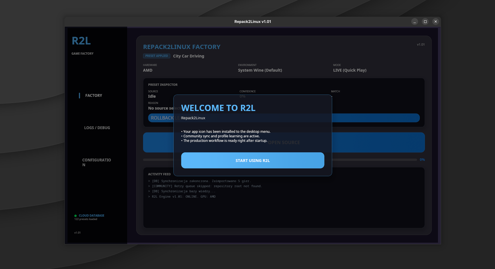
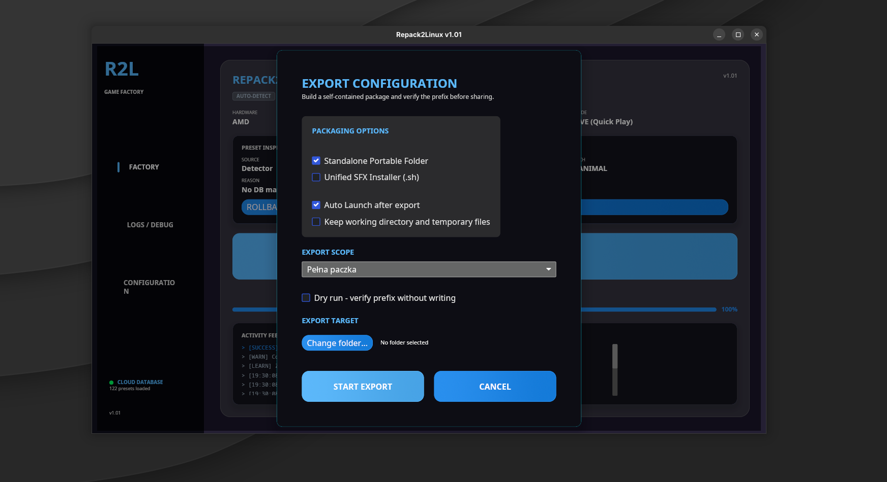
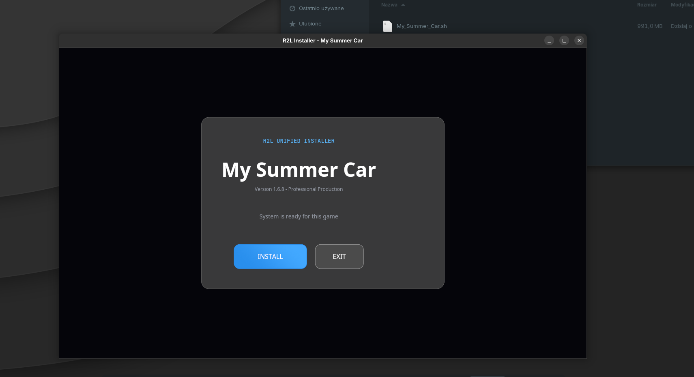

# Repack2Linux (R2L)

English-first README for the project.  
Polish version is available here: **[README.pl.md](./README.pl.md)**.

Desktop tool that automates installing and converting Windows game repacks for Linux using Wine/Proton.

<p>
  
  
  
  
</p>

## What is R2L?
Repack2Linux is a desktop app that turns Windows game installers/repacks into portable Linux-ready packages.
It scans and configures Wine prefixes, exports portable bundles, and generates smart launchers (`play_auto.sh`) with automatic recovery/fallback behavior.

## Why use it?
- End-to-end automation from source folder to runnable package.
- Portable-first architecture with isolated game data.
- Learned profiles for better defaults over time.
- Integrated GE-Proton workflow and improved auto-detection.
- Automated icon extraction from game executables.

## Screenshots
| Factory | Export | Installer |
|---|---|---|
|  |  |  |

## Quick Start
```bash
git clone https://github.com/KrystianG06/Repack2Linux.git
cd Repack2Linux
cargo run --bin repack2linux-rs
```

## Build Release
```bash
chmod +x build_release.sh
./build_release.sh
```

Artifacts:
- `dist/Repack2Linux-v1.3.0-<target>.tar.gz`
- `dist/Repack2Linux-v1.3.0-<target>.sha256`

## Known-good local validation
```bash
cargo check
cargo test
cargo clippy --all-targets
./build_release.sh
```

## Typical Workflow
1. Select source folder (installer or unpacked game files).
2. Let R2L detect/suggest best profile and executable.
3. Run production/test launch from the app.
4. Export portable package or SFX installer.
5. Launch using `play_auto.sh`.

## Docs
- Progress report: [`PROGRESS.md`](./PROGRESS.md)
- Project overview: [`PROJECT_OVERVIEW.md`](./PROJECT_OVERVIEW.md)
- Stabilization audit: [`STABILIZATION_REVIEW.md`](./STABILIZATION_REVIEW.md)
- Proton roadmap: [`PROTON_IMPROVEMENTS_TODO.md`](./PROTON_IMPROVEMENTS_TODO.md)


## Troubleshooting (Linux GUI startup)
If the app/installer does not open (Wayland/X11 backend issues), run:
```bash
./scripts/gui_backend_diagnostics.sh
```

Try forcing backend explicitly:
```bash
WINIT_UNIX_BACKEND=wayland cargo run --bin repack2linux-rs
WINIT_UNIX_BACKEND=x11 cargo run --bin repack2linux-rs
```

Installer variant:
```bash
WINIT_UNIX_BACKEND=wayland cargo run --bin installer_gui -- <args>
WINIT_UNIX_BACKEND=x11 cargo run --bin installer_gui -- <args>
```

## FAQ
**Where are saves located?**  
Inside package folder: `./r2p_userdata` (usually `Local` subfolder).

**Which launcher script should I use?**  
Use `./play_auto.sh`.

**How do I create a desktop shortcut?**  
Use `ADD SHORTCUT` in Settings.

**What if a game shows black screen?**  
Auto mode retries with safe settings. You can also run `./play_safe.sh` manually.

## License
This project is released under **GNU GPLv3** (see `Repack2Linux/LICENSE`).
